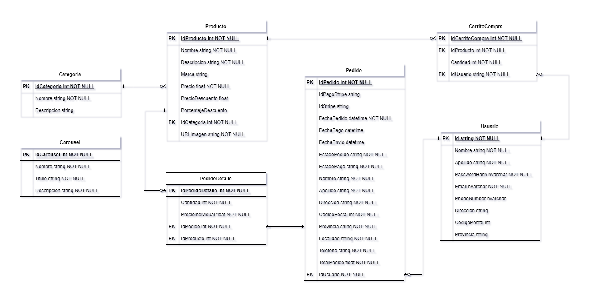

<h1 align="center" style="display:flex;justify-content:center; align-items:center;"></img> ecommerce web</h1>

  

   
  
  
  
  
  
  
  

## ✍ Descripción:
Este proyecto consiste en un sitio web de e-commerce que permite a los usuarios registrarse, iniciar sesión y explorar una amplia gama de productos disponibles.
Los usuarios pueden efectuar pagos a través de Stripe y realizar un seguimiento del estado de sus pedidos. Además, los administradores tienen la capacidad de gestionar productos, usuarios y pedidos.

## 📜 Características
- **Gestión de productos:** Permite la gestión completa de productos, incluyendo la creación, edición y eliminación. Además, proporciona funciones para la visualización de detalles de productos, búsqueda y filtrado.
- **Carrito de compras:** El proyecto cuenta con un carrito de compras funcional que permite a los usuarios agregar productos, modificar cantidades y realizar el proceso de compra. Por lo que ofrece una experiencia fluida y sencilla para los usuarios al realizar sus pedidos
- **Diseño Responsive:** El sitio posee un diseño responsive que se adapta automáticamente a diferentes tamaños de pantalla y dispositivos gracias a la integración de Bootstrap 5
- **Envío de emails través de SMTP:** Se ha implementado la funcionalidad de envío de emails utilizando el protocolo SMTP (Simple Mail Transfer Protocol). Esto permite enviar confirmaciones de cuentas nuevas, pedidos y otra información relevante a los usuarios por correo electrónico.
- **Gestión de usuarios con ASP.NET Core Identity:** La administración de usuarios, contraseñas, roles, tokes, etc; se maneja a través del API Identity
- **Integración con Stripe:** Los pagos de los pedidos se resuelven mediante el uso del API de Stripe
## 📁 Esquema Visual de la Base de Datos

	

## 👁️ Vista previa

  

